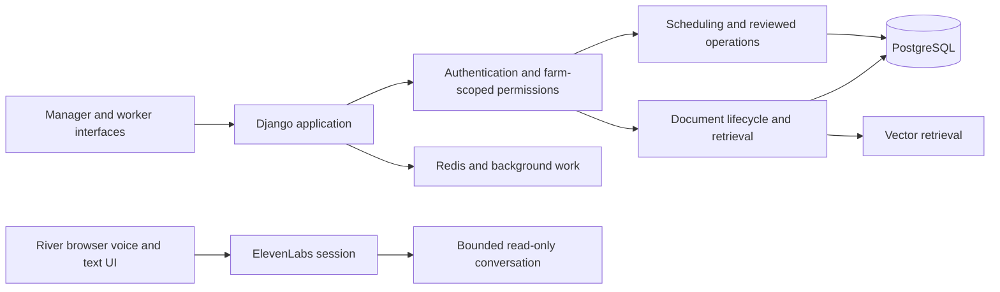

# AgDesk and River: farm operations and voice interaction

An engineering contribution case study by Santiago Gonzalez Alvarez, based on a University of Sydney team capstone. AgDesk combines scheduling, document management, evidence-backed answers, and human-reviewed farm operations. River is an isolated voice interaction prototype developed alongside the project.

This repository explains my individual work and the decisions behind it. The main application is a team project. University assessment source, client material, credentials, operational records, and teammates' implementation are not included in this public case study.

## The customer problem

Farm operations combine changing staff availability, equipment constraints, operational records, and documents. A useful assistant has to fit those workflows while keeping permission checks and human approval visible. A plausible answer or a polished calendar is insufficient if the underlying records are stale or a concurrent change can invalidate the action.

## My contribution

My implementation and review work covered:

- A manager week calendar and job board for live schedules.
- Template management and propose/approve controls.
- Worker schedule views and job cards.
- Document review and access controls, including stale-edit checks and atomic publication.
- Citation checks that bind an answer to the relevant source, entity, and requested field.
- Concurrency and idempotency fixes around scheduling and document lifecycle operations.
- Regression tests, integration work, and a broader codebase audit.
- A bounded comparison of RAG framework options and honest reporting of evaluation limitations.
- Temporary user-testing deployment work.
- River's isolated voice interface, text fallback, permission recovery, session handling, and provider integration.

These are contribution areas, not a claim that I designed or implemented the entire platform. [Contribution evidence](docs/CONTRIBUTIONS.md) separates merged team work, deployment work, and the voice prototype.

## System architecture

AgDesk uses Django, PostgreSQL/pgvector, Redis/Django-RQ, HTMX interfaces, and AI/RAG components. River uses a JavaScript SDK, an isolated Django host, and a provider voice session. The prototype's conversational boundary does not perform farm database writes or operational bookings.

## Three engineering decisions

### Review must refer to the version that was reviewed

If a document changes after a reviewer opens it, approving the old form must not silently approve the replacement. The implementation work introduced freshness checks and atomic publication boundaries so the reviewed evidence and the published state remain connected.

### Authorization must survive concurrent changes

A permission check at the beginning of a long request can become stale. Retrieval and publication paths need to recheck the relevant membership and ownership at the point where data is returned or an effect is committed. Consistent lock ordering matters when several operations touch the same host and document records.

### An answer needs evidence for the actual question

Related facts are not always an answer. Citation work focused on the requested field, the correct entity, source uncertainty, and preserved excerpts. Evaluation reporting kept excluded and unavailable cases visible, so an offline smoke run could not be presented as evidence of answer quality.

## River: practical voice interaction

The isolated River prototype explored microphone permission, real-time voice, interruption, readable transcripts, and text-only fallback. Its UI handles cancellation and late provider callbacks, preserves drafts through connection failures, and bounds session duration. Automated checks use fake provider/media adapters; live listening remains a separate acceptance step.

The provider configuration explored GPT-4.1 Mini and Scribe speech recognition through ElevenLabs. This case study includes no public agent identifier, account configuration, transcript, recording, or account credential. It does not claim production voice deployment.

## Verification and limits

This publication review checked contribution history and the relationship between recorded changes and the claims above. It did not rerun the entire current AgDesk platform or establish a new production certification. The application is not runnable from this documentation-only repository.

The source remains private while university, team, and client publication rights are unresolved. A later source release would require explicit permission, a curated snapshot, synthetic fixtures, asset provenance, and a new security review. A live user-testing deployment does not establish permission to publish source.

For interview discussion, I can explain the architecture and my decisions within those confidentiality limits. See [design discussion](docs/DESIGN.md) for the failure cases I use to reason about the system.
